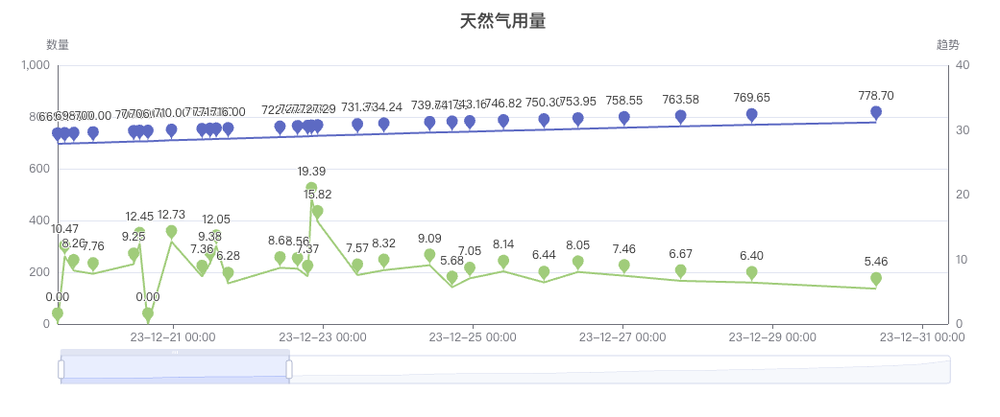

echarts 功能很强大，但是要在vue3 项目中使用，配置却有点麻烦，记录一下在vue3中使用，以后可以直接复制代码

echarts 在v5之后，为了适配 各种前端框架，减少打包体积，开始采用组件库的思路组织代码，对之前熟悉了引入就能用，整体一个包的模式，有点无从下手，现在开始使用：

## 引入依赖

```swift
pnpm add echarts vue-echarts
```

echarts 是 本体，vue-echarts 是一个vue 的组件，方便在vue 代码中使用echarts。

## 使用前初始化

echarts 组件化后，使用前需要初始化，加载需要的功能组件，这样就只引入项目使用的组件，不会整体加载，减少了构建包的体积。 一般在项目中可以单独用一个文件来初始化加载本项目要用到的 echarts 组件、图表， 因为vue 有插件机制，可以把初始化放到一个插件中：

```tsx
// echarts-init.ts

import { use } from "echarts/core";
import { CanvasRenderer } from "echarts/renderers";
import { PieChart, LinesChart, LineChart } from "echarts/charts";
import {
  TitleComponent,
  TooltipComponent,
  LegendComponent,
  GridComponent,
  DataZoomComponent,
  DatasetComponent,
} from "echarts/components";
import { THEME_KEY } from "vue-echarts";
import { type App, type Plugin } from "vue";
import VChart from "vue-echarts";

export const echartsInitPlugin: Plugin = (app: App, ...options: any[]) => {
  use([
    CanvasRenderer,
    DatasetComponent,
    PieChart,
    LinesChart,
    LineChart,
    TitleComponent,
    TooltipComponent,
    LegendComponent,
    GridComponent,
    DataZoomComponent,
  ]);

  app.provide(THEME_KEY, "");
  // 把echart 组成到
  app.component("v-chart", VChart);
};
```

在程序入口使用初始化插件

```tsx
//main.ts

import { useEchartsInit } from "./common/charts-init";

// 初始化echarts
app.use(echartsInitPlugin);
```

### 图表组件

```tsx
<template>
    <div>
        <v-chart class="chart" :option="chartOptions" />
    </div>
</template>

<script setup lang="ts">

import { onMounted, reactive } from "vue";
import { curl, type IRes } from "@/common/http";

const aDay = 1000 * 60 * 60 * 24;

interface RecordRow {
    created: string,
    count: number,
    kind: number,
    trend: number,
    [key: string]: any,
}

const chartOptions = reactive({
    tooltip: {
        trigger: 'axis',
        valueFormatter: function (value: string | number) {
            return typeof value == 'number' ? value.toFixed(2) : value;
        }
    },
    dataset: {
        dimensions: ['created', 'count', 'kind', 'trend'],
        source: [] as any[]
    },
    title: {
        left: 'center',
        text: '天然气用量'
    },

    xAxis: {
        type: 'time',
        axisLabel: {
            formatter: "{yy}-{MM}-{dd} {HH}:{mm}",
        },

        // boundaryGap: false
    },
    yAxis: [
        {
            type: 'value',
            axisLine: {
                show: true,
            },
            name: "数量",
            splitLine: {
                show: true,
            },
            boundaryGap: [0, '100%']
        },
        {
            type: 'value',
            name: '趋势(每天)',
            axisLine: {
                show: true,
            },
            boundaryGap: [0, '100%'],
            splitLine: {
                show: false,
                lineStyle: {
                    color: ["#4E88E6"]
                }
            },

        }
    ],
    dataZoom: [
        {
            type: 'inside',
            start: 0,
            end: 100
        },
        {
            start: 0,
            end: 100
        }
    ],
    series: [
        {
            name: '天然气用量',
            type: 'line',
            symbol: 'pin',
            symbolSize: 20,
            yAxisIndex: 0,
            label: {
                show: true,
            },
            encode: {
                x: 'created',
                y: 'count'
            }
        },
        {
            name: '用气趋势',
            type: 'line',
            symbol: 'pin',
            symbolSize: 20,
            yAxisIndex: 1,
            label: {
                show: true,
                formatter: function ({ value }: { value: RecordRow }) {
                    return value.trend.toFixed(2)
                }
            },
            encode: {
                x: 'created',
                y: 'trend'
            }
        }
    ]

});

onMounted(() => {

    curl.get<IRes<any[]>>('/expend/gas').subscribe(res => {
        console.log(res)
        if (res.code == 200) {
            // @ts-nocheck
            chartOptions.dataset.source = res.data.map((item, index, arr) => {
                let trend = 0;
                if (index !== 0) {
                    let diff = item.count - arr[index - 1].count;
                    let span = (new Date(item.created).getTime() - new Date(arr[index - 1].created).getTime()) / aDay
                    trend = diff / span;
                }

                return {
                    ...item,
                    trend
                }
            }) as any[]
        }
    })

})

</script>

<style scoped>
.chart {
    height: 400px;
}
</style>
```

效果如下：



## 最后

[echarts 的配置](https://echarts.apache.org/zh/option.html#xAxis.splitLine.interval)

[echarts 示例](https://echarts.apache.org/examples/zh/index.html)

[echarts 文档](https://echarts.apache.org/handbook/zh/get-started/)